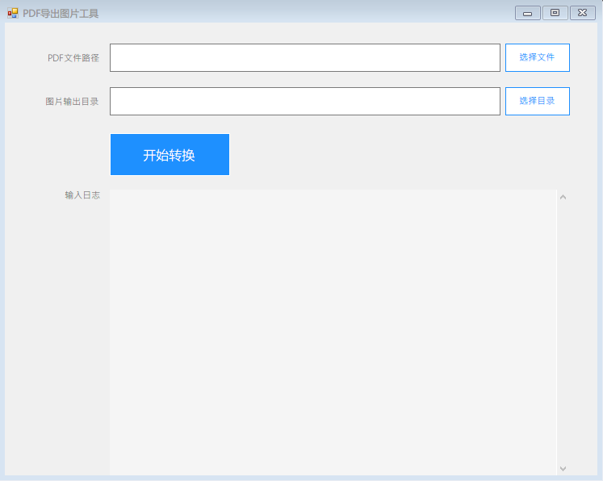

# PdfToImage
将PDF格式文件按照页码，转成图片文件。

## 使用说明
1. 下载“gs9550w64.exe”，按照安装向导进行安装。
2. 双击“PDFToJpg.exe”文件。
3. 在打开的窗口中，首先点击“选择文件”按钮，选择一个PDF格式的文件。
4. 再点击“选择目录”按钮，选择一个空文件夹，用来存储转换后的图片文件。
5. 点击“开始转换”按钮，程序会自动进行进行转换，如果文件较大，可能需要等待较长时间，请耐心等待。
6. 当弹框“转换成功”提示时，则表示转换完成，可以去上述步骤3中选择的目录查看导出的图片文件。

## 依赖
- [Magick Net](https://github.com/dlemstra/Magick.NET)
- [GhostScript](https://ghostscript.com/releases/gsdnld.html)